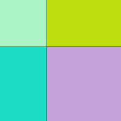
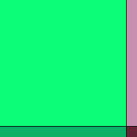
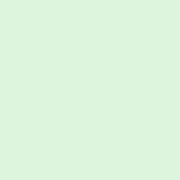
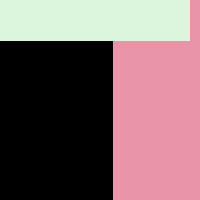
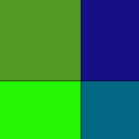

# avatar-practice
**From the [Go Bootcamp](https://github.com/GoBootcamp/avatarme):** Given a personal information such as an email address, IP address, or a public key, the program you will write needs to generate a unique avatar. Imagine that you are building a new application and you want all of your users to have a default and unique avatar. The package you will write will allow the generation of such avatars. GitHub recently used such an approach and generates an identicon for all new users who don't have a gravatar account attached.

## Resources
http://golang.org/pkg/crypto/  
http://golang.org/pkg/image/  
http://en.wikipedia.org/wiki/Identicon  
http://haacked.com/archive/2007/01/22/Identicons_as_Visual_Fingerprints.aspx/

## Takeaways & challenges

After working on this for a while, I've learned that the main challenge of this exercise is to figure out the best logic for associating the values in the hash with characteristics of the desired image. I found this challenging and am still working on ways to improve it so that each image is truly unique. Right now, the uniqueness depends mainly on the colors in the image, which originate from some of the hash values. For instance, the following inputs have these results:

**Update**: The way the image is filled is changed to use each of the values of the hash. This might be the most hack solution possible, but it creates a pretty cool effect for the resulting png, which is more unique in most cases. See below for updates!

input: `hello`  

        New version :arrow_right:    

input: `hellomy`  

        New version :arrow_right:  

input: `hellomyname`  

        New version :arrow_right:   

input: `hellomynameis`  

        New version :arrow_right:   

input: `hellomynameiszoe`  

      New version :arrow_right:   

